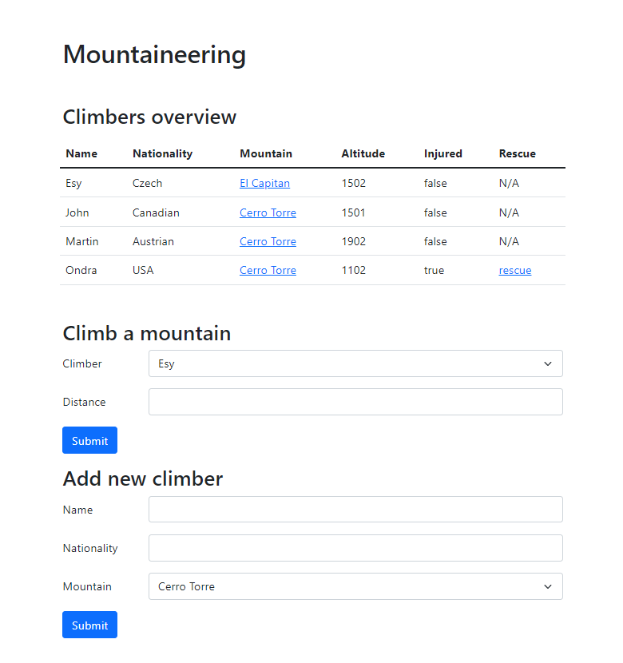
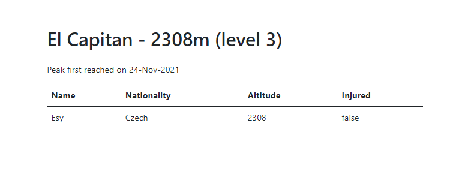

# Bengalensis Meridian Orientation Trial Exam

## Getting Started

- **Fork** this repository to your own account
- Clone the forked repository to your computer
- Create a new folder `mountaineering` and a new `Mountaineering` 
Java Spring Book / Gradle project inside it. 
- Your repository folder structure should resemble the 
following:

```
!git/
assets/
├─ index.png
├─ mountains-show.png
templates/
├─ layouts/
│  ├─ layout.html
├─ mountains/
│  ├─ show.html
├─ index.html
mountaineering/
├─ .gradle/
├─ .idea/
├─ build/
├─ gradle/
├─ src/
├─ .gitignore
├─ build.gradle
├─ gradlew
├─ gradlew.bat
├─ settings.gradle
README.md
```
- Commit your progress frequently and with descriptive commit messages

## Keep in mind

- You can use any resource online, but **please work individually**
- **Don't just copy-paste** your answers and solutions, use your own words
  instead
- **Don't push your work** to GitHub until your mentor announces that the time
  is up
- Before diving to coding **think about the structure**
- If anything about description is unclear, ask your mentor :)

## Mountaineering

Our goal is to build an application that will help us keep track of mountain 
climbers trying to ascend mountains.

## Domain

- Every **climber** should have the following:
  - name (String)
  - nationality (String)
  - Mountain (see below)
  - altitude (Integer, default = 0) - climber's altitude of the current climb 
  - injured (Boolean, default = false) - climber's injury status; please note 
  that the getter for this field should be `isInjured`

- Every **mountain** should have the following:
  - name (String) 
  - height (Integer)
  - firstAscend (Date, default = null) - the date when the first climber 
  reached the top; null if no one has reached the top yet
  - climbers (List) - lists of the climbers currently on the mountain
  
## Frontend

- Use the provided [templates](templates). You can simply put these into the
`/src/main/resources/templates` folder. Your `templates` folder structure 
should look like the following

```text
src/
├─ main/
│  ├─ resources/
│  │  ├─ static/
│  │  ├─ templates/
│  │  │  ├─ mountains/
│  │  │  │  ├─ show.html
│  │  │  ├─ layouts/
│  │  │  │  ├─ layouts.html
│  │  │  ├─ index.html
```

You only need to make minor edits to `index.html` and `show.html` to have them
display the data correctly. Look for the `TODO` comments in each, e.g.

```html
<!-- TODO: add the condition when the message should be displayed and set the message text -->
<div class="alert alert-danger" role="alert"></div>
```

## Database

It is up to you to define what the database model will look
like, it just needs to help backend fulfill the requirements given below

The requirements are:

- all climbers and mountains data must be stored in a database (MySQL, or H2)
- climbers and mountains must be stored in separate tables
- there must be some relationship between the climbers and mountains tables

## Sample data

If you set up your entities and repositories correctly, you add the
following sample data import to the application main class 
`MountaineeringApplication` which is (should be) located in the
 `/src/main/java/com/greenfox/mountaineering` folder

```java
@SpringBootApplication
public class MountaineeringApplication implements CommandLineRunner {

    private final MountainRepository mountainRepository;
    private final ClimberRepository climberRepository;

    @Autowired
    public MountaineeringApplication(MountainRepository mountainRepository, 
                                     ClimberRepository climberRepository) {
        this.mountainRepository = mountainRepository;
        this.climberRepository = climberRepository;
    }

    @Override
    public void run(String... args) throws Exception {

        addSampleData();
    }

    private void addSampleData(){

        Mountain m1 = mountainRepository.save(new Mountain("El Capitan", 2308));
        Mountain m2 = mountainRepository.save(new Mountain("Cerro Torre", 3128));
        Mountain m3 = mountainRepository.save(new Mountain("Matterhorn", 4478));
        Mountain m4 = mountainRepository.save(new Mountain("Kilimanjaro", 5895));
        Mountain m5 = mountainRepository.save(new Mountain("Denali", 6190));

        climberRepository.save(new Climber("Esy", "Czech", m1, 1502, false));
        climberRepository.save(new Climber("Martin", "Austrian", m2, 1902, false));
        climberRepository.save(new Climber("Ondra", "USA", m2, 1102, true));
        climberRepository.save(new Climber("John", "Canadian", m2, 1501, false));
    }

    public static void main(String[] args) {
        SpringApplication.run(MountaineeringApplication.class, args);
    }
}
```

## Endpoints

### GET `/`



- This endpoint should display the following:
  - "Mountaineering" title
  - "Climbers overview" section title
  - A table listing all climbers
    - Climbers should be ordered alphabetically by their names in ascending 
	order
    - Each row should contain the following:
      - name
      - nationality
      - link to the mountain on which the climber is (the link's label should 
      be the mountain's name)
      - altitude (the current altitude of the climber on the mountain)
      - injury status (true/false)
      - rescue (see the `GET /climbers/{id}/rescue` endpoint below)
        - if rescue is not available (the climber is not injured) display 
        simple text "N/A"
        - if the climber is injured, display the link to rescue him/her (the 
        link's label should be "rescue" and the url should be 
        `/climbers/{id}/rescue`
  - "Climb a mountain" form, with the following fields:
    - Climber select (drop-down) listing all climbers (sorted alphabetically 
    in ascending order by the climber's name)
    - Distance (type=number, min=0)
    - Submit button
  - "Add new climber" form, with the following fields:
    - Name, `name` (type=text)
    - Nationality, `nationality` (type=text)
    - Mountain select, `mountain-id` (drop-down) listing all mountains 
    (sorted alphabetically in ascending order by the mountain's name)
    - Submit button

- The "Climb a mountain" form should be submitted to the `POST /climbers/climb` 
endpoint
- The "Add new climber" form should be submitted to the `POST /climbers` 
endpoint

### GET `/mountains/{id}`



- This endpoint should display the following:
  - A title in the format of "Name - Height (Difficult Level)"
    - add 'm' (meters) after the height
    - The mountain's difficulty level should be calculated as 
    `(height / 1000) + 1`
    - e.g. "El Capitan - 2308m (level 3)"
    - *add a `getTitle` method to the `Mountain` model instead of doing the
      formatting in Thymeleaf/template*
  - A line with the first ascend info
    - if no one has ever reached the top, display "Peak has never been reached"
    - otherwise, display "Peak first reached on _date_", where *date* should be 
    in the "dd-MMM-yyyy" format, e.g. 01-Jan-2021
  - A table listing all climbers currently on this mountain
    - Each row should cointain the following:
      - name
      - nationality
      - altitude
      - injury status (true/false)
    - Climbers should be sorted by their current altitude in desc order (you 
    can either use the `stream` API for this sorting, or google how to sort a 
    list from a mapping using annotations)
    - If there are no climbers on the mountain display a single row with the 
    text "No climbers"

- If the mountain does not exist (non-existent id), or the id value is not an 
integer/long (e.g. `GET /mountains/aaa`) display the error message 
"Error: Mountain not found!"

### POST `/climbers`

- This endpoint handles adding new climbers to the application

  - If any of the request parameters (name, nationality, mountain-id) is `null` 
  or `empty`, or if there is no mountain with the spcified id, **redirect** 
  back to the `GET /` endpoint and display the error message "Error: Missing 
  data!". 
  - If all data is valid, create a new climber with the specified name, 
  nationality, mountain, and with the default values of altitude = 0 and 
  injured = false
  - You don't need to validate that the value of the `mountain-id` is a number 
  (assume users do not know how to use the browser inspector)

### POST `/climbers/climb`

- This endpoint handles "climbing"

  - **redirect** back to the `GET /` endpoint and display the error message 
  "Error: Climb failed!" in the following scenarios:
    - any of the request parameters (id, distance) is `null` or `empty`
    - there is no climber with the specified id
    - the distance value is less than 0 (or it is not an integer)
    - the climber is already injured (his/her injury status is `true`)
    - the climber is already at the top
    - the climber gets injured on this climb
      - the chance of injury is calculated as the mountain's difficulty level * 
      10; this value cannot be higher than 70! e.g. if the difficulty level is 
      4 then the probability of injury is 4 * 10 = 40%, if the difficulty level 
      is 8 then the probability of injury 8 * 10 = 80 -> 70%, i.e. 

```java
int injuryProbability = Math.min(70, climber.getMountain().getDifficulty() * 10);
```

  - If the submitted data is valid **and** the climber does **not** get injured 
  on this climb, the value of `distance` should be added to the climber's 
  `altitude`
  - If the climber reaches the top (climber's altitude is >= the mountain's 
  height
    - set the climber's altitude to the mountain's height (the altitude cannnot 
    be greater)
    - check whether the climber is the first to ever reach the top of the 
    mountain, and if so, set the mountain's `firstAscend` value to the current 
    date
  - Redirect back to the `GET /` endpoing and display the success message 
  "Success: Climb successful!"

### GET `/climbers/{id}/rescue`

- Use this endpoing to send rescue for an injured climber

  - **redirect** back to the `GET /` endpoint and display the error message 
  "Error: Rescue failed!" in the following scenarios:
    - the `id` request parameter is `null` or `empty`
    - there is no climber with the specified `id` (or the id is not an integer)
    - the climber is not injured (injury status is `false`)
  
  - Otherwise "rescue" the climber by:
    - setting his/her altitude to 0
    - setting his/her injury status to `false`

  - Redirect back to the `GET /` endpoing and display the success message 
  "Success: Climber rescued!"


### GET `/api/climbers?nationality=US&above=1500`

- This endpoint returns data about climbers of the specified `nationality` who 
are currently `above` a certain altitude:

  - if the `above` request parameter is `null`, `empty` or the value is not an
  integer, use the value of 0 (as default)
  - if the `nationality` request parameter is `null` or `empty` ignore it
  - the `nationality` search should look for *partial* matches (substring) and 
  it should be case-insensitive, e.g. searching for 'us' should match both 
  `USa` and `aUStria`
  - the result should be ordered by the climbers' current altitude in 
  descending order

http://localhost:8080/api/climbers?nationality=us&above=1000

```json
[
    {
        "name":"Martin",
        "nationality":"Austrian",
        "altitude":1902,
        "injured":false,
        "mountain":"Cerro Torre"
    },
    {
        "name":"Ondra",
        "nationality":"USA",
        "altitude":1102,
        "injured":true,
        "mountain":"Cerro Torre"
    }
]
```

## SQL Question

Here is the database setup for the questions/tasks below:

```sql
CREATE TABLE `applicants` (
  `id` int PRIMARY KEY,
  `name` varchar(255) NOT NULL,
  `country_id` int NOT NULL,
  `age` smallint NOT NULL,
  `preference` varchar(255) NOT NULL
);

CREATE TABLE `countries` (
  `id` int PRIMARY KEY,
  `country` varchar(255) NOT NULL
);

ALTER TABLE `applicants` ADD FOREIGN KEY (`country_id`) REFERENCES `countries` (`id`);
```

```sql
INSERT INTO countries (id, country) VALUES 
(1, "Czech Republic"),
(2, "Hungary");

INSERT INTO applicants (id, name, country_id, age, preference) VALUES
(1, "Bořivoj Souček", 1, 24, "Java"),
(2, "Papp Patrícia", 2, 33, "JavaScript"),
(3, "Kocsis Ivett", 2, 37, "Python"),
(4, "Slavomír Vykukal", 1, 20, "Java"),
(5, "Bruno Malík", 1, 31, "Java"),
(6, "Veronika Lukešová", 1, 18, "JavaScript"),
(7, "Székely Miklós", 2, 29, "Python"),
(8, "Hegedüs Benjámin", 2, 37, "Python"),
(9, "Nela Machová", 1, 20, "Python"),
(10, "Balog Rajmund", 2, 39, "Java");
```

Write queries that:

1. Select the `name` and `preferences` of applicants under `age` of 30 from 
`Hungary` (using name of the country within query, and not the `country_id` 
value)

```text
| name           | preference |
|----------------|------------|
| Székely Miklós | Python     |
```

Answear:
```sql
select a.name, a.preferences
from applicants a
    join countries c on c.id = a.country_id
where age = 30 and c.country = 'Hungary';
```

2. Update the preference of all hungarian applicants to Unknown (you can use 
the `country_id` value here)

```text
| id | name              | country_id | age | preference |
|----|-------------------|------------|-----|------------|
| 1  | Bořivoj Souček    | 1          | 24  | Java       |
| 2  | Papp Patrícia     | 2          | 33  | JavaScript |
| 3  | Kocsis Ivett      | 2          | 37  | Unknown    |
| 4  | Slavomír Vykukal  | 1          | 20  | Java       |
| 5  | Bruno Malík       | 1          | 31  | Java       |
| 6  | Veronika Lukešová | 1          | 18  | JavaScript |
| 7  | Székely Miklós    | 2          | 29  | Unknown    |
| 8  | Hegedüs Benjámin  | 2          | 37  | Unknown    |
| 9  | Nela Machová      | 1          | 20  | Python     |
| 10 | Balog Rajmund     | 2          | 39  | Java       |
```

Answear:
```sql
update applicants set preference = 'Unknown'
where country_id = 2;
```

3. Show the average age of Czech and Hungarian applicants:

```text
| country        | average_age |
|----------------|-------------|
| Czech Republic | 22.6000     |
| Hungary        | 35.0000     |
```

Answear:
```sql
select c.country, AVG(a.age) as average_age
from applicants a
join countries c on a.country_id = c.id
group by c.id
```
